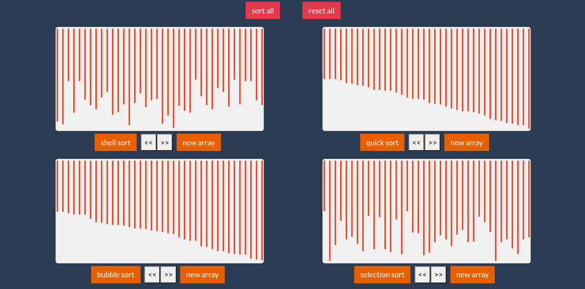

# Table of content

-   **[About](#about)**
-   **[App Url](#app-url)**

# About

This is my second algorithms visuliser application ([link](https://github.com/alae-touba/pathfinding-visualisation) to first one). This the app visualise sorting algorithms.

currently implemented algorithms are:

-   quick sort
-   shell sort
-   insertion sort
-   selection sort
-   bubble sort

# App Url

Here is the url for the app: 
